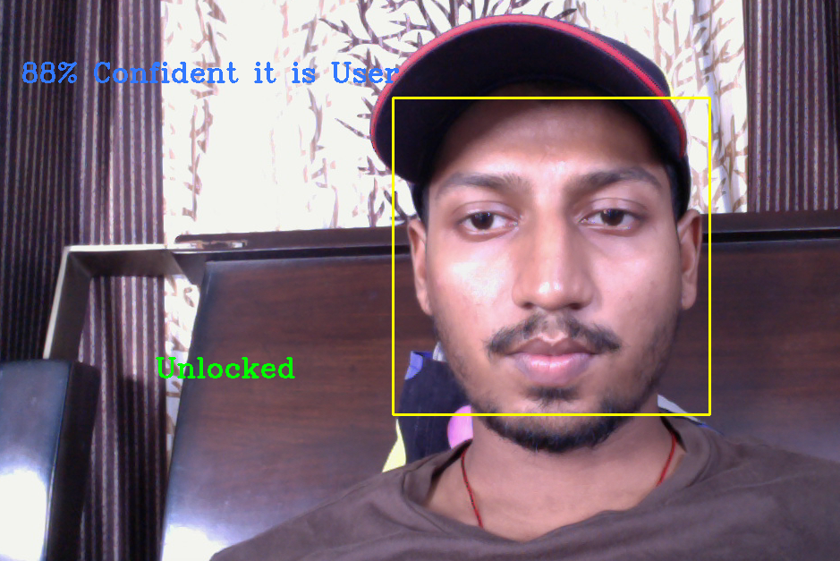

## Face-Unlock
Face Unlock Feature - Unlock your device using Facial Recognition

<h1> About Project </h1>

<h5> We will create our Training Data </h5>
<ul>
  <li>Record of 100 Images of our face using HAAR Cascade Face Detector</li>
  <li>Normalize by grayscaling and resizing to 200x200</li>
  <li>Creating an array of labels for recorded image</li>
</ul>

<h5>After we will classify New Faces</h5>
<ul>
  <li> Extract Face form webcam using HAAR Cascade Face Detector </li>
  <li> Normalize by Grayscaling and resizing to 200x200 pixels</li>
  <li> Pass Face to our model predictor to get lables & confidence value</li>
</ul>

<h4> There are 3 sets of code </h4>
<ul>
  <li>Creating Training Data</li>
  <li>Training Model</li>
  <li>Running Facial Recognition system</li>
 </ul>
 
 <h4> Here it is </h4>
 

